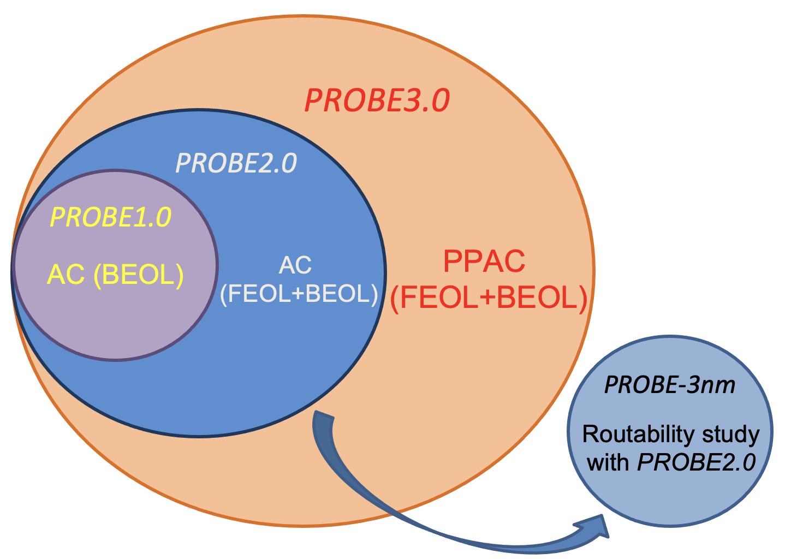
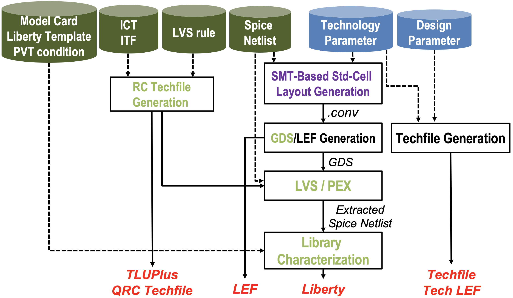
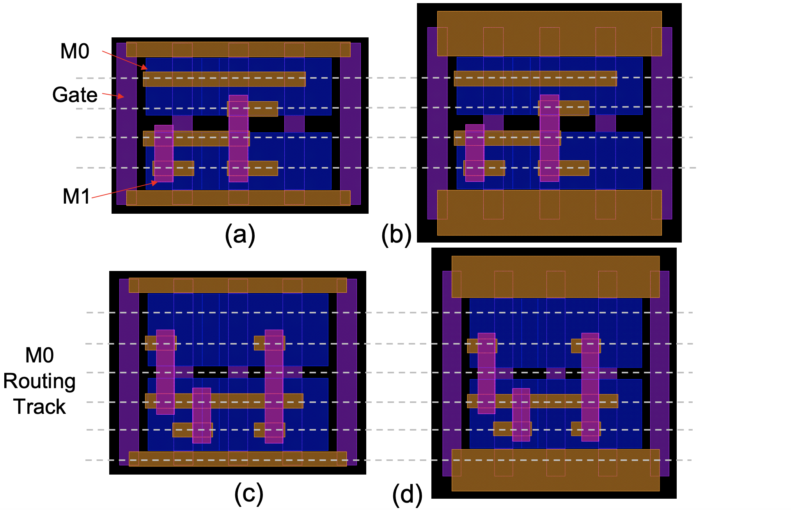
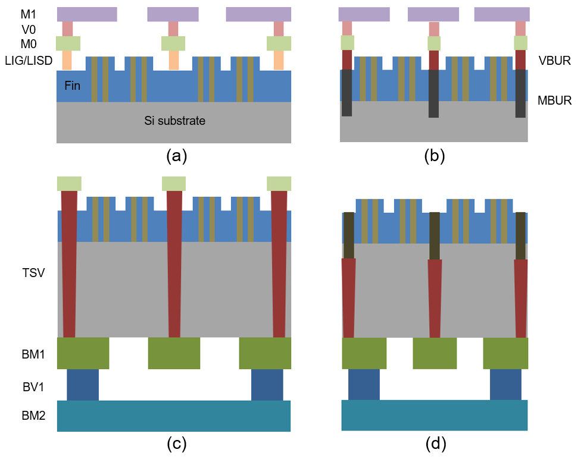
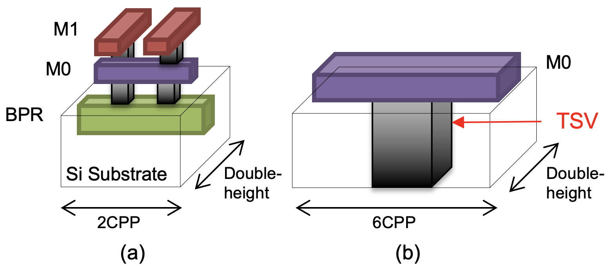
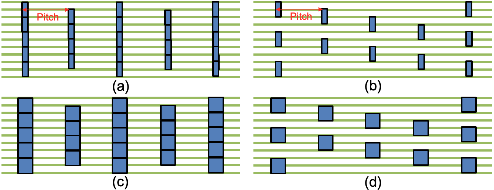
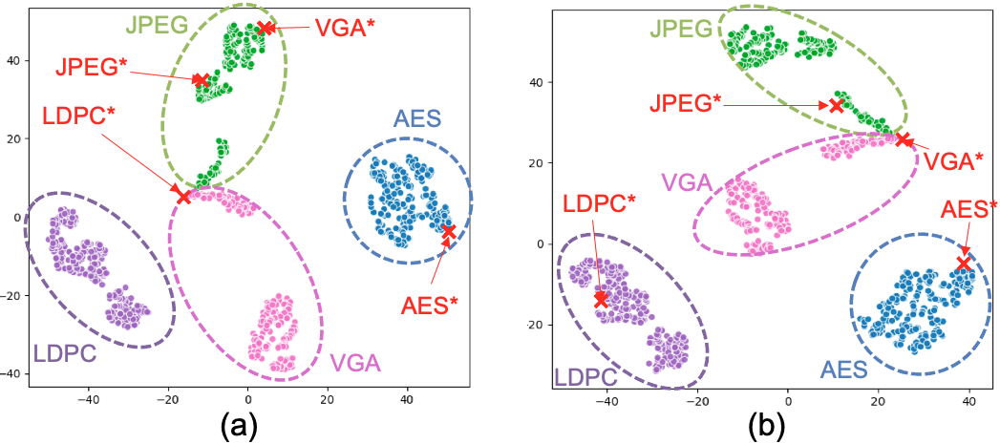
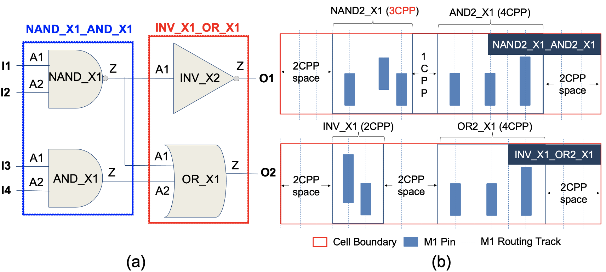
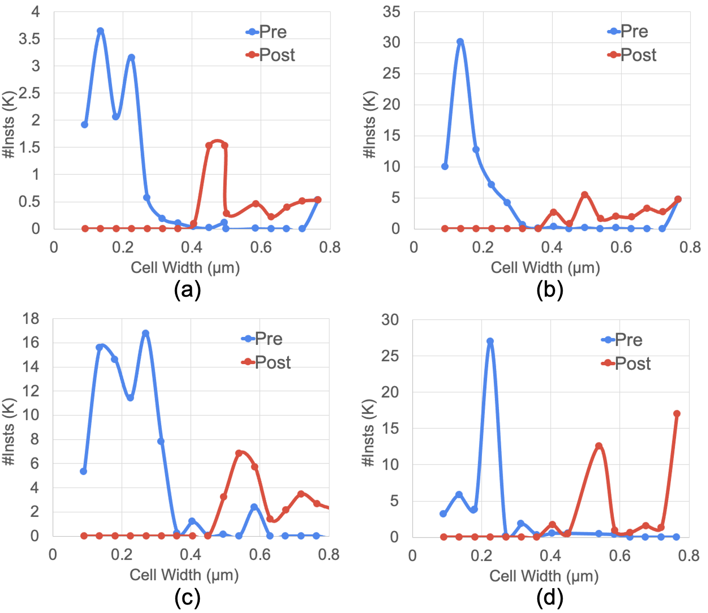

# PROBE3.0: A Systematic Framework for Design-Technology Pathfinding with Improved Design Enablement

**Suhyeong Choi**, *Graduate Student Member, IEEE*, **Jinwook Jung**, *Member, IEEE*, **Andrew B. Kahng**, *Fellow, IEEE*, **Minsoo Kim**, *Member, IEEE*, **Chul-Hong Park**, *Member, IEEE*, **Bodhisatta Pramanik**, *Graduate Student Member, IEEE*, and **Dooseok Yoon**, *Graduate Student Member, IEEE*

---

## Abstract

We propose a systematic framework to conduct design-technology pathfinding for PPAC in advanced nodes. Our goal is to provide configurable, scalable generation of process design kit (PDK) and standard-cell library, spanning key scaling boosters (backside PDN and buried power rail), to explore PPAC across given technology and design parameters. We build on \[6\], which addressed only area and cost (AC), to include power and performance (PP) evaluations through automated generation of full design enablements. We also improve the use of artificial designs in the PPAC assessment of technology and design configurations. We generate more realistic artificial designs by applying a machine learning-based parameter tuning flow to \[16\]. We further employ *clustering-based cell width-regularized placements* at the core of routability assessment, enabling more realistic placement utilization and improved experimental efficiency. We demonstrate PPAC evaluation across scaling boosters and artificial designs in a predictive technology node.

---

{width="3.312498906386702in" height="1.233332239720035in"}

Fig. 1. The DTCO process consists of three main stages: *Technology*, *Design Enablement*, and *Design*. Figure is redrawn from \[47\].

---

## Introduction

The DTCO process is not simple: feedback from design stage to technology stage takes weeks to months of turnaround time, along with immense engineering efforts. Also, based on the design feedback, additional PDKs may need to be generated at the design enablement stage, which requires additional weeks to months. In order to reduce the turnaround time and maximize the benefit of the DTCO process, a fast and accurate DTCO methodology is needed to assess PPAC with reasonable turnaround time, and to more precisely guide multi-million dollar decisions at an early stage of technology development. **Contributions of Our Work.** Compared to the previous works PROBE1.0 \[13\] and PROBE2.0 \[6\], our new framework provides three main technical achievements: \(1\) **We establish the first comprehensive end-to-end design and technology pathfinding framework.** \[6\]\[13\] focus on area and cost without considering power and performance. Thus, there is a significant discrepancy between \[6\]\[13\] and the actual DTCO process in the industry. In this work, we propose a more complete and systematic PROBE3.0 framework, which incorporates power and performance aspects for design-technology pathfinding at an early stage of technology development. \(2\) **We improve our designs for PPAC explorations.** Design is a critical factor for PPAC explorations, and artificially generated designs enable us to explore a wider solution space. We leverage \[16\] to generate artificial designs. To create more realistic artificial designs, we develop a machine learning (ML)-based parameter tuning flow built on \[16\] to find the best input parameters for generating such designs.

---

{width="2.6152777777777776in" height="1.8611111111111112in"}

Fig. 2. Scope of PROBE-related works. PROBE1.0 \[13\] and PROBE2.0 \[6\] address AC given BEOL and FEOL/BEOL, respectively. PROBE-3nm \[7\] studies routability (AC) with sub-3nm technology configurations. PROBE3.0 provides true full-stack PPAC pathfinding with automatic generation of EDA tool enablements.

Section V details our artificial design generation flow. Further, *cell width-regularization* is employed in \[6\]\[13\] to prevent illegal placements when swapping neighboring cells to assess the routability metric, *Kth*. We propose a *clustering-based cell width-regularization* to achieve more realistic utilization (and faster routability assessment) as described in Section VI. (3) **We demonstrate the PPAC exploration of scaling boosters.** We incorporate scaling boosters (BSPDN and BPR) to support P&R and IR drop analysis flows within the framework, as detailed in Section IV. Our results show that incorporating BSPDN and BPR leads to a reduction in power consumption by up to 8% and area by up to 24% based on our predictive 3nm technology. The area reduction results are consistent with those reported in previous industry works \[10\]\[22\]\[29\]\[31\], which have demonstrated area reductions of 25% to 30% through the use of BSPDN and BPR techniques.

Due to limited access to advanced technology for academic research, we build our predictive 3nm technology, named *the PROBE3.0 technology*. To calibrate the technology, we refer to the International Roadmap for Devices and Structures (IRDS) \[40\], open-sourced PDKs, and other publications \[2\]\[8\]\[23\]\[37\]. We open-source our work, including process design kits (PDKs), standard-cell libraries, and scripts for P&R and IR drop analysis; this is available in our GitHub repository \[48\]. In Section III, we provide details on the automated PDKs and library generation flows, while in Section VII, we present three experiments to demonstrate the effectiveness of the PROBE3.0 framework for PPAC pathfinding.

---

{width="3.3819444444444446in" height="1.9694444444444446in"}

Fig. 3. Automatic standard-cell library and PDK generation (Design Enablements) in the PROBE3.0 framework. In addition to technology and design parameters in the PROBE3.0 framework, other technology-related inputs are required: (i) Device model cards, (ii) Liberty templates, (iii) Process/Voltage/Temperature (PVT) conditions, (iv) Interconnect technology files (ICT or ITF formats), (v) LVS rules, and (vi) SPICE netlists.

---

## Standard-Cell Library and PDK Generation

Expediting the DTCO process requires automation of the standard-cell library and PDK generation flows. Therefore, the PROBE2.0 framework \[6\] introduces standard-cell layout and PDK generation flows and utilizes them for routability assessments. In this work, we extend the PROBE2.0 framework to include proper electrical models of standard-cell libraries and interconnect layers for design-technology pathfinding. Additionally, we enhance the PDK generation flow to support advanced nodes. While the PROBE2.0 framework solely focuses on the physical layout of standard cells, the PROBE3.0 framework enables true full-stack PPAC pathfinding through automated, configurable standard-cell and PDK generation flows for advanced nodes. To demonstrate the use of PROBE3.0 for advanced-node PPAC pathfinding, we use a technology that incorporates cutting-edge (3nm FinFET) technology predictions based on the works of \[8\]\[40\].

---

## Related Work

**Advanced Technology Research PDKs.** PDKs of advanced node technologies are highly confidential. Academic research can be blocked by limited access to relevant information. To unblock academic research, predictive advanced-node PDKs have been published. ASAP7 \[8\] is a predictive PDK for 7nm FinFET technology that includes standard cells which support commercial logic synthesis and P&R. FreePDK3 \[23\]\[37\] and FreePDK15 \[2\] are open-source PDKs for 3nm and 15nm technology. \[15\] proposes a 3nm predictive technology called NS3K with nanosheet FETs (NSFET). The authors of \[15\] also create 5nm FinFET and 3nm NSFET libraries to compare power, performance and area.

**Design-Technology Co-Optimization.** Previous DTCO works evaluate block-level PPAC and optimize design and technology simultaneously. \[25\] proposes UTOPIA to evaluate block-level PPAC with thermally limited performance, and to optimize device and technology parameters. \[18\] proposes a fast pathfinding DTCO flow for FinFET and complementary FET (CFET). \[3\] also proposes a fast and agile technology pathfinding platform with compact device models to accelerate the DTCO process. \[12\] describes power delivery network pathfinding for 3D IC technology to study tradeoffs between IR drop and routability. \[5\] uses ML to predict sensitivities to changes for DTCO.

**Scaling Boosters.** As described in Section I, scaling boosters are used in advanced nodes to maximize the benefit of new technology. BSPDN and BPR are among the most promising scaling boosters in sub-5nm nodes. \[21\] carries out a CPU implementation with BSPDN and BPR in their 3nm technology, demonstrating a reduction of up to 7X in worst IR drop. Similarly, \[22\] investigates BSPDN and BPR at sub-3nm nodes and finds that they can lead to a 30% reduction in area based on IR drop mitigation. \[4\] also explores the impact of BSPDN and BPR on design, concluding that their use can lead to a 43% reduction in area with 4X less IR drop. \[10\] studies BSPDN configurations with µTSVs, and observes 25% to 30% reduction in area using BSPDN and BPR. Additionally, \[24\] investigates BSPDN with nTSVs and µTSVs and finds that the average IR drop with BSPDN improves by 69% compared to traditional frontside PDN (FSPDN). Finally, \[27\] conducts holistic evaluations for BSPDN and BPR, demonstrating that FSPDN with BPR achieves a 25% lower on-chip IR drop, while BSPDN with BPR achieves an 85% lower on-chip IR drop with iso-performance and iso-area. In contrast to these previous DTCO works, here we propose a highly configurable framework that enables more efficient investigation of scaling boosters in advanced nodes.

**"PROBE" Frameworks.** Prior "PROBE" \[6\]\[13\] works propose systematic frameworks for assessing routability with different FEOL and BEOL configurations. Specifically, \[13\] begins with an easily-routable placement and increases the routing difficulty by random neighbor-swaps until the routing fails with greater than a threshold number of design rule violations (DRCs). The normalized number of swaps at which routing failure occurs, denoted by *Kth*, is a metric used to measure the inherent routability of the given parameters. On the other hand, \[6\] introduces an automatic standard-cell layout generation using satisfiability modulo theory (SMT) to support explorations of both FEOL and BEOL configurations. The authors of \[6\] also employ machine learning (ML)-based *Kth* prediction to expedite the DTCO pathfinding process. Additionally, \[7\] employs PROBE2.0 in a routability study with sub-3nm technology configurations.

---

## A. Overall flow
Figure 3 describes our overall flow of standard-cell and PDK generation. Technology and design parameters are defined as input parameters for the flow. Beyond these input parameters, there are additional inputs required to generate standard-cell libraries and PDKs, as follows: 
- SPICE model cards
- Liberty template and PVT conditions
- Interconnect technology files (ICT/ITF)
- LVS rule deck
- SPICE netlists

Given the inputs, our SMT-based standard-cell layout generation and GDS/LEF generation are executed sequentially. Generation of timing and power models (Liberty) requires additional steps including LVS, parasitic extraction and library characterization flow. Aside from the standard-cell library generation, we also generate interconnect models from ICT/ITF, and P&R routing technology files from technology and design parameters. The PDK elements that we generate feed seamlessly into commercial logic synthesis and P&R tools. Further, to the best of our knowledge, ours is the first-ever work that is able to disseminate all associated EDA tool scripts for research purposes.

## B. PROBE3.0 Technology
We build our own predictive 3nm technology node, called the PROBE3.0 technology. Based on [8], we define our FEOL and BEOL layers as described in Table I. We assume that all BEOL layers are unidirectional routing layers. Hence, we first change M1 to a unidirectional routing layer with vertical preferred direction, since the work of [8] has a bidirectional M1 routing layer. We add an M0 layer with horizontal preferred direction below the modified M1 layer, and we add contact layers V0 and CA which respectively connect between M1 and M0, and between gate/source-drain and M0.

Also, electrical features of technologies are critical to explore "PP" aspects. Therefore, parasitic extractions of standard cells and BEOL metal stacks are important steps. To extract parasitic elements, interconnect technology files are required to use commercial RC extraction, P&R and IR drop analysis tools. In this work, we use commercial tools [35][43][46] for extractions, and each tool has its own technology file format. Interconnect technology files include layer structures of technology and electrical parameters, such as thickness, width, resistivity, dielectric constant and via resistance. We refer to the values of physical features in the 3nm FinFET technology of [40], such as fin pitch, fin width, gate pitch, gate width, metal pitch and aspect ratio. We also refer to [40] for the values for electrical parameters such as via resistance and dielectric constant. Table II describes key features of the PROBE3.0 technology.

The file formats for each tool are unique. The MIPT file format is for Siemens Calibre [43] for extraction, and is converted to an RC rule file for standard-cell layout extractions. On the other hand, the ICT and ITF file formats are for Cadence and Synopsys extraction tools, respectively. We convert ICT to QRC techfile, and ITF to TLUPlus file, to enable P&R tools and IR drop analysis.

## C. Improved Standard-Cell Library Generation
We generate standard-cell libraries via several steps illustrated in Figure 3: 
1. SMT-based standard-cell layout generation
2. Generation of GDS and LEF files
3. LVS and PEX flow
4. Library characterization flow.

### SMT-Based Standard-Cell Layout Generation
In recent technology nodes, standard-cell architectures use a variety of pitch values for different layers in order to optimize power, performance, area and cost (PPAC). To accommodate this, PROBE3.0 improves the SMT-based layout generation used in PROBE2.0 to support non-unit gear ratios for M1 pitch (M1P) and contacted poly pitch (CPP).

Our standard-cell layouts are generated using SPICE netlists, technology and design parameters from [6]. However, in PROBE3.0 we change two key parameters: metal pitch (MP) and power delivery network (PDN). Instead of using MP, we define parameters for pitch values of each layer. Since M0, M1 and M2 layers are used for standard-cell layouts, we define M0P, M1P and M2P as pitches of M0, M1 and M2 layers, respectively. Table 4 shows four layouts of AND2 X1 cells with four parameter settings. The four standard-cell libraries (Lib1, Lib2, Lib3 and Lib4) along with their corresponding parameter sets are used for our experiments in Section VII. For our PPAC exploration, we generate 41 standard cells for each standard-cell library as shown in Table III.

### GDS/LEF Generation and LVS/PEX Flow
While [6] only supports LEF generation for P&R, PROBE3.0 generates standard-cell layouts in both GDS and LEF formats. The GDS files are used to extract parasitics from standard-cell layouts and check LVS between layouts and schematics. We use Calibre [43] to check LVS and generate extracted netlists for standard cells with intra-cell RC parasitics. Scripts for GDS/LEF generation and LVS/PEX flows are open-sourced in [48].

### Library Characterization Flow
We perform library characterization to generate standard-cell libraries in the Liberty format. The inputs to the flow are model cards for FinFET devices, Liberty template including PVT conditions, and interconnect technology files. We use model cards from [37]. For the Liberty template, we define the PVT conditions, and the capacitance and transition time indices of (7*×*7) tables for electrical models (delay, output transition time, and power). We use 5, 10, 20, 40, 80, 160, and 320ps as the transition time indices. For the input capacitance, we obtain the input pin capacitance Cinv of an X1 inverter, then multiply this value by predefined multipliers, 2, 4, 8, 16, 24, 32, and 64. For characterization, we use the PVT corner (TT, 0.7V, 25°C).

Fig. 4. Example standard cells (AND2 X1) in this work.

## IV. POWER DELIVERY NETWORK
We study PDN scaling boosters to showcase the DTCO and pathfinding capability of PROBE3.0. There are two key challenges of traditional PDNs at advanced technologies:

- High resistance of BEOL: Elevated resistance in BEOL layers exacerbates IR drop issues, necessitating denser PDN topologies.
- Routing overheads (routability): PDN occupies routing resources that are shared with signal and clock distribution. The routability and area density impact of PDN becomes more severe with denser PDN at advanced nodes.

To overcome these challenges, multiple foundries have begun implementing backside power delivery networks (BSPDN) and buried power rails (BPR) as scaling boosters in their sub-5nm technologies. We use these scaling boosters, BSPDN and BPR, to demonstrate use of PROBE3.0. We establish four options for PDN parameter in the PROBE3.0 framework: 
- Frontside PDN without BPR (PFS)
- Frontside PDN with BPR (PFB)
- Backside PDN without BPR (PBS)
- Backside PDN with BPR (PBB)

Fig. 5. Cross-section view of four PDN options in the PROBE3.0 framework.

### A. Frontside and Backside Power Delivery Network
We have defined realistic structures for both frontside power delivery networks (FSPDN) and backside power delivery networks (BSPDN), and enabled IR drop analysis within our framework. Table IV shows the configurations for FSPDN and BSPDN. Since BEOL layers with smaller pitches (e.g., 24nm-pitch layer) have high resistance, we add power stripes for every layer. While the work of [6] has multiple options for FSPDN, the PROBE3.0 framework has only one PDN structure for FSPDN. Instead, we add other options such as PFB, PBS and PBB. Furthermore, while the Backside option in [6] assumes no PDN at the frontside for the BSPDN option, we add power stripes at the backside for BSPDN in the PROBE3.0 framework to enable IR drop analysis for BSPDN.

### B. Frontside and Backside PDN with Buried Power Rail
In advanced nodes, power rails on BEOL metal layers can be "buried" into FEOL levels with shallow-trench isolation (STI). Using deep trench and creating space between devices lowers the resistance of power rails. In addition to the resistance benefits, standard-cell height (area) can be further reduced with deep and narrow widths of power and ground pins.

Fig. 6. Power tap cells for (a) PF B and (b) PBS.

### C. Power Tap Cell Insertion
Although use of BSPDN and BPR can reduce area and mitigate IR drop problems, connecting frontside layers to BSPDN and/or BPR remains a critical challenge. To establish "tap" connections from frontside metals to BPR, or from backside to frontside metals, space must be reserved on device layers -- e.g., [21] proposes power tap cells for the connection between BPR to MINT (M0) layers. More frequent "taps" will mitigate IR drop problems, but occupy more placement area. In PROBE3.0, we define two types of power tap cells for the PFB and PBS options. Tap cells for PFB connect BPR to M1, and tap cells for PBS connect BM1 to M0. By contrast, PFS and PBB do not require power tap cells.

Fig. 7. Four power tap cell insertion results.

### D. IR Drop Analysis Flow
We develop two IR drop analysis flows for FSPDN and BSPDN. Figure 8(a) presents our IR drop analysis flow for FSPDN. After P&R, we generate DEF and SPEF files for routed designs using a commercial P&R tool to perform standalone vectorless dynamic IR drop analysis. Additionally, an interconnect technology file (QRC techfile) is needed for RC extraction as input for the IR drop analysis flow. In contrast, Figure 8(b) depicts our IR drop analysis flow for BSPDN. After P&R, we only create a SPEF file from routed designs. We then remove all routed signals and clocks from the P&R database and construct new power stripes for BSPDN. Since the standalone IR drop analysis tool obtains power stripe information from a DEF file, we generate a DEF file after creating power stripes on the backside. There are two backside metal layers, BM1 and BM2. When creating PDN on backside metal layers, we consider M1 as BM1 and M2 as BM2, respectively. For RC extraction with BSPDN, the QRC techfile must be scaled for backside metals since we assume BM1 and BM2 have the same pitches as M12 and M13. Full details are visible in open-source scripts at [48].

# TABLE V
## DEFINITION OF TOPOLOGICAL PARAMETERS IN ANG [16][30].

| Parameter     | Definition                                                   |
|---------------|--------------------------------------------------------------|
| Ninst (T1)    | Number of instances.                                         |
| Nprim (T2)    | Number of primary inputs/outputs.                            |
| Davg (T3)     | Average net degree. The net degree of a net is the number of terminals of the net. |
| Bavg (T4)     | Average size of net bounding box. The placed (or routed) layout is divided into a bin grid where each bin contains√Ninst instances. |
| Tavg (T5)     | Average depth of timing paths. The depth of a given timing endpoint is the maximum number of stages in any fanin combinational path of that endpoint. Tavg is the average of all endpoint depths. |
| Sratio (T6)   | Ratio of the number of sequential cells to the total number of cells. Sratio equals to number of sequential cells over total number of instances. |

> PROBE3.0 overcomes these limitations by generating artificial but realistic netlists with the Artificial Netlist Generator (ANG) of [16][30], for use in PPAC studies. We use the six topological parameters of ANG (see Table V) to generate and explore circuits with various sizes, interconnect complexity, routed wirelengths and timing. Moreover, we apply machine learning (AutoML) to improve the match of generated artificial netlists to targeted (real) netlists.

## A. Comparison of ANG and Real Designs

In this subsection, we study four real designs from Open-Cores [41] and the corresponding artificial netlists generated by ANG [16]. Each design is taken through commercial logic synthesis and P&R tools [44][45] in the PROBE3.0 technology, to obtain a final-routed layout. For AES, JPEG, LDPC and VGA, we respectively use target clock periods of 0.2ns, 0.2ns, 0.6ns and 0.2ns, and utilizations of 0.7, 0.7, 0.2 and 0.7. We then extract the six topological parameters from the routed designs and use these parameters to generate artificial netlists with ANG.

We introduce a Score metric to quantify similarity between artificial and real netlists, as defined in Equation (1).

# TABLE VI
## TOPOLOGICAL PARAMETERS FOR REAL NETLISTS FROM OPENCORES [41] AND ARTIFICIAL NETLISTS GENERATED BY [16]. DESIGN NAMES FOLLOWED BY * INDICATE ANG-GENERATED ARTIFICIAL NETLISTS.

| Design | Parameters | Score |
|--------|------------|-------|
|        | Ninst      | Nprim | Davg  | Bavg  | Tavg  | Sratio |
|--------|------------|-------|-------|-------|-------|--------|
| AES    | 12318      | 394   | 3.28  | 0.55  | 7.98  | 0.04   |
| JPEG   | 70031      | 47    | 3.09  | 0.21  | 10.36 | 0.07   |
| LDPC   | 77379      | 4102  | 2.85  | 1.00  | 12.94 | 0.03   |
| VGA    | 60921      | 185   | 3.71  | 0.42  | 8.25  | 0.28   |
|--------|------------|-------|-------|-------|-------|--------|
| AES*   | 10371      | 394   | 3.28  | 0.79  | 5.19  | 0.13   | 8.53  |
| JPEG*  | 63185      | 47    | 3.16  | 0.70  | 6.97  | 0.15   | 12.03 |
| LDPC*  | 58699      | 4106  | 3.10  | 0.78  | 6.96  | 0.13   | 14.8  |
| VGA*   | 64412      | 188   | 3.32  | 0.26  | 6.39  | 0.25   | 2.8   |

# B. Machine Learning-Based ANG Parameter Tuning

We improve the realism of generated artificial netlists with ML-based parameter tuning for ANG. Figure 9(a) shows the training flow in the parameter tuning. First, to generate training data, we sweep the six ANG input parameters to generate 21,600 combinations of input parameters, as described in Table VII. Second, we use ANG with these input parameter combinations to generate artificial gate-level netlists. Third, we perform P&R with the (21,600) artificial netlists and extract the output parameters. The extracted output parameters are used as output labels for the ML model training. We use the open-source H2O AutoML package [39] (version 3.30.0.6) to predict the output parameters; the StackedEnsemble AllModels model consistently returns the best model. The model training is a one-time overhead which took 4 hours using an Intel Xeon Gold 6148 2.40GHz server. Executing commercial P&R required just over 7 days in our academic lab setting, and is again a one-time overhead.

Figure 9(b) shows our inference flow. First, we define ranges around the target parameter and sweep the parameters to generate multiple combinations of input parameters as candidates, which are shown in Table VII. Second, we use our trained model to predict the output parameters from each input parameter combination. Note that although there are 12.3M combinations as specified in the rightmost two columns of Table VII, this step requires less than 10 minutes on an Intel Xeon Gold 6148 2.40GHz server. Third, we calculate a predicted Score per each input parameter combination, and then choose the parameter combination with lowest predicted Score. Finally, we use ANG and the chosen parameter combination to generate an artificial netlist for P&R and PPAC explorations.

# TABLE VII
## PARAMETER SETS FOR TRAINING AND TESTING. WE TRAIN OUR ML MODEL WITH ANG INPUT PARAMETERS AND POST-P&R OUTPUT PARAMETERS. THE TOTAL NUMBER OF DATAPOINTS IS 4 * 6 * 6 * 5 * 5 * 6 = 21600. TESTING IS PERFORMED IN THE RANGES AROUND GIVEN TARGET PARAMETERS, ACCORDING TO THE STEP SIZES.

| Parameter  | Training Value | Testing Range | Step |
|------------|----------------|---------------|------|
| Ninst (T1) | 10000, 20000, 40000, 80000 | Ttarget ± 500 | 100  |
| Nprim (T2) | 100, 200, 500, 1000, 2000, 4000 | Ttarget ± 2 * 5 | 1    |
| Davg (T3)  | 2.00, 2.50, 3.00, 3.50, 4.00 | Ttarget ± 0.25 | 0.01 |
| Bavg (T4)  | 0.50, 0.75, 1.00, 1.25, 1.50, 1.75, 2.00 | Ttarget ± 0.1  | 0.01 |
| Tavg (T5)  | 2.00, 2.50, 3.00, 3.50, 4.00, 4.50 | Ttarget ± 0.25 | 0.01 |
| Sratio (T6)| 0.05, 0.10, 0.15, 0.20, 0.25, 0.30 | Ttarget ± 0.01 | 0.001|

## V. CASE STUDIES

In this section, we use the proposed PROBE3.0 flow to study two case studies: (i) parametric variation of FPGA fabric topologies, and (ii) understanding the impact of placement algorithms on PPAC. These case studies allow us to explore and understand the implications of topological parameters on PPAC. The generated synthetic circuits have the same topological parameters, but the design structures are different. In the following subsections, we describe the experimental setup and results for these case studies.

### A. Parametric Variation of FPGA Fabric Topologies

We use PROBE3.0 to study the impact of FPGA fabric topologies on PPAC, using synthetic circuits generated with ANG. We generate synthetic circuits with different topological parameters, as listed in Table VIII. We then synthesize and place and route (P&R) each synthetic circuit on an FPGA with PROBE3.0. After P&R, we perform post-P&R analysis to extract PPAC metrics. We perform this study for different target FPGA fabrics: (i) fabric A with lower interconnect density and (ii) fabric B with higher interconnect density. In each fabric, we use different placement algorithms to explore their impact on PPAC. We quantify the PPAC for each synthetic circuit and placement algorithm pair with a Score metric, as described in Section IV-A.

# TABLE VIII
## FPGA FABRIC PARAMETERS FOR PARAMETRIC VARIATION CASE STUDY.

| Fabric | Interconnect Density | Placement Algorithm |
|--------|----------------------|---------------------|
| A      | Lower                | Force-directed (F-D)| 
| B      | Higher               | Genetic algorithm (GA)| 

### B. Understanding the Impact of Placement Algorithms on PPAC

We use PROBE3.0 to study the impact of placement algorithms on PPAC, using synthetic circuits generated with ANG. We generate synthetic circuits with different topological parameters, as listed in Table VIII. We then synthesize and place and route (P&R) each synthetic circuit on an FPGA with PROBE3.0. After P&R, we perform post-P&R analysis to extract PPAC metrics. We perform this study for different placement algorithms: (i) force-directed placement (F-D) and (ii) genetic algorithm (GA). We quantify the PPAC for each synthetic circuit and placement algorithm pair with a Score metric, as described in Section IV-A.

## TABLE VIII

### TOPOLOGICAL PARAMETERS FOR TARGET, INPUT AND OUTPUT NETLISTS

| Parameter | Parameters of Target Netlists | ANG Input Parameters (ML Inference) | Parameters from Artificial Netlists |
|-----------|-------------------------------|---------------------------------------|---------------------------------------|
| Ninst     | 12318                         | 12718                                 | 10200                                 |
| Nprim     | 394                           | 390                                    | 394                                   |
| Davg      | 3.28                          | 3.40                                   | 3.26                                  |
| Bavg      | 0.55                          | 0.49                                   | 0.72                                  |
| Tavg      | 7.98                          | 13.98                                  | 8.01                                  |
| Sratio    | 0.04                          | 0.01                                   | 0.11                                  |
| Score     | -                             | -                                      | 4.39                                  |

**Figure 10.** Comparison between real and artificial designs by t-SNE.

Figure 10(b) shows that with our ML-based ANG parameter tuning, datapoints of all four artificial designs are located within the corresponding clusters of real designs. This suggests that the ML-based ANG parameter tuning helps create artificial netlists that better match targeted design parameters -- including parameters that are relevant to PPAC exploration.

---

## VI. CELL WIDTH-REGULARIZED PLACEMENTS FOR MORE REALISTIC ROUTABILITY ASSESSMENT

Recall that in the PROBE approach, routability ("AC") is evaluated using the *K*-threshold (*Kth*) metric \[13\]. That is, given a placed netlist, routing difficulty is gradually increased by iteratively swapping random pairs of neighboring instances. The cell-swaps progressively "tangle" the placement until it becomes unroutable (>\* 500 DRCs post-detailed routing). The number of swaps *K* -- expressed as a multiple of the instance count -- at which routing fails is the *Kth* metric. Larger *Kth* implies greater routing capacity or intrinsic routability.

Both PROBE1.0 \[13\] and PROBE2.0 \[6\] enable the study of real netlists through the concept of a *cell width-regularized* placement. In this approach, combinational cells are inflated (by LEF modification) to match the maximum width among all the combinational cells in the cell library. This process, called *cell width-regularization*, prevents illegal placements (i.e., cell overlaps due to varying widths) from arising due to neighbor-swaps during *Kth* evaluation. Unfortunately, while cell width-regularization permits real designs to be placed and then tangled by random neighbor-swaps, it also forces low utilizations that harm the realism of the study. (Moreover, high whitespace leads to high *Kth* values that require more P&R runs to determine.)

We now describe a *clustering-based* *cell width-regularization* methodology that generates placements with realistic utilizations, based on real designs.

**Figure 11.** Two example clustered cells NAND X1 AND X1, and INV X1 OR X1 in clustering-based cell width-regularization.

---

### A. Clustering-Based Cell Width-Regularization

We propose *clustering-based cell width-regularization* using bottom-up hypergraph clustering, as detailed in Algorithm 1.

#### Algorithm 1: Cell width-regularization by clustering

**Inputs:** Hypergraph *H*(*V, E, W*), Maximum cell width *wmax*, Number of iterations *Niter*

**Outputs:** Clustered hypergraph *Hout*(*Vout, Eout, Wout*)

In our experiments, we set *Niter* = 20. However, the cell width-regularized clustering is strongly constrained by *wmax*, and we observe on our test cases that clustering stops after ~ 3 iterations.

---

### B. Performance of Clustered Cell Width-Regularization

#### Comparison to Previous Cell Width-Regularization

**Figure 12.** Cell width distributions pre-clustering (i.e., original netlist) and post-clustering (i.e., by *CWR-FC*) for (a) AES, (b) JPEG, (c) LDPC and (d) VGA.

Table IX compares characteristics of our clustering-based cell width-regularized netlists and placements ([C]), versus analogous characteristics of real netlists and placements ([A]). We also implement another plausible clustering methodology, which is to induce clusters from a placement of the original design ([B]). In [B], clusters from the placement are induced by traversing combinational cells left-to-right in each standard cell row, and clustering maximal contiguous sets of cells without exceeding *Wmax*.

We run P&R using *Lib2* and *PF S* for PDN, maintaining the same core area and utilization. Clustering decreases the number of instances and average fanouts for [B] and [C], relative to [A]. However, wirelengths exhibit no significant changes. The similarities between [A], [B] and [C] suggest that our *CWR-FC* methodology can preserve netlist properties relevant to P&R outcomes, with more realistic placement utilization.

# VII. EXPERIMENTAL SETUP AND RESULTS

We have extensively studied the design-technology pathfinding capability of the PROBE3.0 framework using the PROBE3.0 technology. In this section, we report three main experiments. Expts 1 and 2 show PROBE3.0's capability to assess PPAC trends and tradeoffs, using real and artificial designs respectively. Expt 3 performs assessments of routability and achievable utilization.

In Expts 1 and 2, we analyze four tradeoffs. 
(i) We present **Performance-Power** plots that quantify tradeoffs between performance (maximum frequency) and power. 
(ii) We present **Performance-Area** plots to quantify the tradeoffs between performance and area. 
(iii) To address PP aspects, we use the **Energy-Delay Product** (EDP) [18] as a single metric for power and performance. **EDP-Area** plots depict tradeoffs between performance/power and area. 
(iv) We present **IR drop-Area** plots to demonstrate tradeoffs between IR drop and area. We also compare results obtained using artificial designs with those obtained using real designs. Expt 3 assesses routability and achievable utilization using our clustering-based cell width-regularized placements.

**A. Experimental Setup**

Based on the definition of technology and design parameters in [6], we define ten technology parameters and eight design parameters as the input parameters for the PROBE3.0 framework. Table X describes the definitions of these parameters and the options used in our experiments. Also, we use commercial tools for PDK generation, logic synthesis, P&R, and IR drop analysis. We use open-source tools for GDT-to-GDS translation [38] and SMT solver [49]. Table XI summarizes the tools and versions that we use in our experiments.

**Criteria for Valid Result.** 
In our experiments, for given *Design*, *PDN* and technology parameters, we perform logic synthesis, P&R and IR drop analysis with multiple sets of parameters including *Ipitch*, *Ischeme*, *Util* and *Clkp*. We use 24, 32, 48, 96 and 128 *CPP* for *Ipitch*, and *Column* and *Staggered* for *Ischeme*. For *Util*, we use values ranging from 0.70 to 0.94 with a step size of 0.02, and for *Clkp*, we use values ranging from 0.12 to 0.24ns with a step size of 0.02ns. Importantly, after the implementation and the analysis steps, we filter out results that are deemed invalid -- in that they are likely to fail signoff criteria even with additional human engineering efforts.

To be precise, a "valid" result must satisfy three conditions: 
(i) the worst negative slack is larger than -50ps; 
(ii) the number of post-route DRCs is less than 500; and 
(iii) the 99.7 percentile of the effective instance voltage is greater than 80% of the operating voltage (*Vop*). To assess (iii), we use a commercial IR drop analysis tool [36] to measure vector-less dynamic IR drop, and calculate the effective instance voltage as *Vop − Vdrop* per each instance, where *Vop* is an operating voltage (0.7V) and *Vdrop* is the worst voltage drop per instance. We take the 99.7 percentile of effective instance voltage as representative of IR drop for the post-P&R result, as it is within three standard deviations from the mean per the empirical rule [28].

**B. Expt 1 (PPAC Exploration with Real Designs)**

**Performance versus Power.** 
We first present PPAC explorations that show tradeoffs between performance and power. (We assume that area is proportional to cost, since chip area is closely related to cost.) In this study, we show results for JPEG with four standard-cell libraries (*Lib1-4*). Also, we use four PDN structures, *PF S*, *PF B*, *PBS* and *PBB*, and measure improvements due to scaling boosters relative to the traditional frontside PDN (*PF S*).

Figure 13(a) gives **Performance-Power** plots that show tradeoffs between performance and power for JPEG, and improvements from the traditional FSPDN. We calculate the maximum achievable frequency (*fmax*) as 1/(*Clkp − WNS*) where *Clkp* is the target clock period and *WNS* is the worst negative slack. Also, we add up leakage and dynamic power to obtain the total power. To measure the improvement from *PF S*, we compare the second-largest value (on the x-axis) attained with each PDN configuration. From the result, we make two main observations. 
(i) Power consumption with *PBS* and *PBB* decreases by 7 to 8%, compared to *PF S* with the same performance. 
(ii) Power consumption with *PF B* is similar to *PF S*, with the same performance. We observe power reductions from use of scaling boosters, BSPDN and BPR. However, use of BPR without BSPDN does not reduce power consumption.

**Performance-Area Tradeoff.** 
Figure 13(b) gives **Performance-Area** plots that show tradeoffs between performance and area for JPEG. In the study, we calculate the chip area as the sum of instances area, routing area and macro cell area. Results show that the use of scaling boosters reduces the area by 5% for both *PBS* and *PBB* compared to *PF S* with the same performance. However, *PF B* increases the area by 3% compared to *PF S* with the same performance.

**Energy-Delay Product Tradeoff.** 
We use the energy-delay product (EDP) as a single metric for power and performance. Figure 13(c) gives **EDP-Area** plots that show tradeoffs between EDP and area for JPEG. We calculate EDP as the product of total power and critical path delay. Results show that the use of scaling boosters, *PBS* and *PBB*, reduces EDP by 7 to 8% compared to *PF S* with the same area. However, *PF B* increases EDP by 10% compared to *PF S* with the same area. 

**IR Drop Tradeoff.** 
Figure 13(d) gives **IR drop-Area** plots that show tradeoffs between IR drop and area for JPEG. We use the same x-axis as the previous plots and calculate the IR drop for the entire chip. Results show that the use of scaling boosters, *PBS* and *PBB*, reduces IR drop by 0.02V compared to *PF S* with the same area. However, *PF B* increases IR drop by 0.03V compared to *PF S* with the same area.

**B. Expt 2 (PPAC Exploration with Artificial Designs)**

**Performance versus Power.** 
Figure 14(a) shows **Performance-Power** plots that show tradeoffs between performance and power for four artificial designs. In this study, we measure performance as the maximum frequency and calculate power as the sum of leakage and dynamic power. Results show that the use of scaling boosters, *PBS* and *PBB*, reduces power consumption by 7 to 8% compared to *PF S* with the same performance. However, *PF B* does not reduce power consumption compared to *PF S* with the same performance.

**Performance-Area Tradeoff.** 
Figure 14(b) shows **Performance-Area** plots that show tradeoffs between performance and area for the four artificial designs. Results show that the use of scaling boosters reduces the area by 5% for both *PBS* and *PBB* compared to *PF S* with the same performance. However, *PF B* increases the area by 3% compared to *PF S* with the same performance.

**Energy-Delay Product Tradeoff.** 
Figure 14(c) shows **EDP-Area** plots that show tradeoffs between EDP and area for the four artificial designs. Results show that the use of scaling boosters, *PBS* and *PBB*, reduces EDP by 7 to 8% compared to *PF S* with the same area. However, *PF B* increases EDP by 10% compared to *PF S* with the same area.

**IR Drop Tradeoff.** 
Figure 14(d) shows **IR drop-Area** plots that show tradeoffs between IR drop and area for the four artificial designs. Results show that the use of scaling boosters, *PBS* and *PBB*, reduces IR drop by 0.02V compared to *PF S* with the same area. However, *PF B* increases IR drop by 0.03V compared to *PF S* with the same area.

**C. Expt 3 (Routability and Achievable Utilization)**

In this experiment, we assess the routability and achievable utilization of JPEG using our clustering-based cell width-regularized placements.

**Routability.** 
Figure 15(a) shows the routability results for JPEG using different PDN structures. We measure routability as the percentage of designs that meet the timing and DRC constraints. Results show that *PBS* and *PBB* have higher routability compared to *PF S* and *PF B*. 

**Achievable Utilization.** 
Figure 15(b) shows the achievable utilization results for JPEG using different PDN structures. We measure achievable utilization as the percentage of instances that can be placed on the chip area. Results show that *PBS* and *PBB* have higher achievable utilization compared to *PF S* and *PF B*.

# VIII. DISCUSSION AND CONCLUSION

In this paper, we have presented the PROBE3.0 framework, a design-technology pathfinding tool for full-chip, path-based performance, power, area, and cost (PPAC) exploration. We have demonstrated the capability of the PROBE3.0 framework using three main experiments. In Expts 1 and 2, we explored PPAC trends and tradeoffs using real and artificial designs. Results show that the use of scaling boosters, BSPDN and BPR, improves performance and reduces power consumption, area, EDP, and IR drop. However, the use of BPR without BSPDN does not reduce power consumption. In Expt 3, we assessed routability and achievable utilization using our clustering-based cell width-regularized placements. Results show that PBS and PBB have higher routability and achievable utilization compared to PF S and PF B. Overall, our experiments demonstrate the effectiveness of the PROBE3.0 framework in guiding the design-technology pathfinding for advanced technologies.

# VIII. CONCLUSION

We have presented PROBE3.0, a systematic and configurable framework for "full-stack" PPAC exploration and pathfinding in advanced technology nodes. We introduce automated PDK and standard-cell library generation, along with enablement of scaling boosters in a predictive 3nm technology. Our work is permissively open-sourced in [GitHub \[48\]](https://github.com/), and includes open-sourceable PDKs and EDA tool scripts that incorporate power and performance considerations into the framework.

## TABLE XII
**Kth COMPARISON FOR THE JPEG DESIGN WITH cell width-regularized placements (A) AND clustering-based cell width-regularized placements (C). Util DENOTES REAL UTILIZATION WITH 0.6 INITIAL UTILIZATION.**

| Rank | PDN | RT | Library | [A] Kth | [A] Util | [C] Kth | [C] Util |
|------|-----|----|---------|---------|----------|---------|----------|
| 1 | PF B | 4 | Lib1 | 6 | 0.14 | 3 | 0.50 |
| 2 | PF S | 4 | Lib2 | 9 | 0.14 | 5 | 0.49 |
| 3 | PBB | 4 | Lib1 | 12 | 0.14 | 7 | 0.50 |
| 4 | PF S | 5 | Lib4 | 15 | 0.14 | 8 | 0.50 |
| 5 | PF B | 5 | Lib3 | 16 | 0.14 | 9 | 0.50 |
| 6 | PBS | 4 | Lib2 | 17 | 0.14 | 13 | 0.49 |
| 7 | PBB | 5 | Lib3 | 18 | 0.14 | 16 | 0.50 |
| 8 | PBS | 5 | Lib4 | 23 | 0.14 | 26 | 0.50 |

We employ artificial netlist generation with a machine learning-based parameter tuning to mimic properties of arbitrary real designs. Along with a new CWR-FC clustering-based width-regularized netlist and placement methodology, this enables PPAC exploration of a much wider space of technology, design enablement, and design options. From our experiments, we find that the use of backside power delivery network (BSPDN) and buried power rails (BPR) can lead to up to 8% reduction in power consumption and up to 24% reduction in area using our predictive 3nm technology. These results from PROBE3.0 closely match previous works [10][22][29][31] which estimated 25% to 30% area reduction from use of BSPDN and BPR.

Ongoing and future directions include the following. 
(i) Improving the software architecture of PROBE3.0 will make it more accessible and flexible for users to pursue their own PPAC explorations. Supporting the addition of user-defined variables can help capture and study variant technology and design assumptions. 
(ii) To improve robustness of the framework, and its usefulness as a "proxy" in real-world advanced technology development and DTCO, improved device models, parasitic extraction models, signoff corner definitions, relevant design examples, etc. will be beneficial. It will also be necessary to add generation of DRC rule decks for commercial tools. 
(iii) While our scripts for commercial tools are shared publicly in our GitHub repository, using these tools still requires valid licenses. Incorporation of open-source tools into the PROBE3.0 framework can potentially lead to highly-scaled deployments, shorter turnaround times, and improved utility to a broader audience.

## ACKNOWLEDGMENTS

We thank Dr. Mustafa Badaroglu at Qualcomm, Dr. Gi-Joon Nam at IBM, Dr. S. C. Song at Google and Prof. Taigon Song at Kyungpook National University for valuable discussions.

## REFERENCES

\[1\] A. Agnesina, K. Chang and S. K. Lim, "VLSI Placement Parameter Optimization using Deep Reinforcement Learning", *Proc. ACM/IEEE Intl. Conf. on Computer-Aided Design*, 2020, pp. 1-9.

\[2\] K. Bhanushali and W. R. Davis, "FreePDK15: An Open-Source Predictive Process Design Kit for 15nm FinFET Technology", *Proc. ACM Intl. Symp. on Physical Design*, 2015, pp. 165--170.

\[3\] D. Chanemougame, J. Smith, P. Gutwin, B. Byrns and L. Liebmann,"Agile Pathfinding Technology Prototyping: the Hunt for Directional Correctness", *Proc. International Conference on Simulation of Semiconductor Processes and Devices*, 2020, pp. 301-305.

\[4\] B. Chava, K. A. Shaik, A. Jourdain, S. Guissi, P. Weckx, J. Ryckaert, G. Van Der Plaas, A. Spessot, E. Beyne and A. Mocuta, "Backside Power Delivery as a Scaling Knob for Future Systems", *Proc. SPIE 10962, Design-Process-Technology Co-optimization for Manufacturability XIII* 1096205 (2019), pp. 1-6.

\[5\] C.-K. Cheng, C.-T. Ho, C. Holtz and B. Lin, "Design and System Technology Co-Optimization Sensitivity Prediction for VLSI Technology Development using Machine Learning", *Proc. ACM/IEEE Intl. Workshop on System-Level Interconnect Prediction*, 2021, pp. 1-8.

\[6\] C.-K. Cheng, A. B. Kahng, H. Kim, M. Kim, D. Lee, D. Park and M. Woo, "PROBE2.0: A Systematic Framework for Routability Assessment from Technology to Design in Advanced Nodes", *IEEE Trans. on CAD* 41(5) (2022), pp. 1495-1508.

\[7\] C. Chidambaram, A. B. Kahng, M. Kim, G. Nallapati, S. C. Song and M. Woo, "A Novel Framework for DTCO: Fast and Automatic Routability Assessment with Machine Learning for Sub-3nm Technology Options", *Proc. IEEE Symposium on VLSI Technology*, 2021, pp. 1-2.

\[8\] L. T. Clark, V. Vashishtha, L. Shifren, A. Gujja, S. Sinha, B. Cline, C. Ramamurthy and G. Yeric, "ASAP7: A 7-nm FinFET Predictive Process Design Kit", *Microelectronics Journal* 53 (2016), pp. 105--115.

\[9\] L. De Moura and N. Bjørner, "Z3: An Efficient SMT Solver", *Proc. Intl. Conf. on Tools and Algorithms for the Construction and Analysis of Systems*, 2008, pp. 337--340.

\[10\] M. O. Hossen, B. Chava, G. Van der Plas, E. Beyne and M. S. Bakir, "Power Delivery Network (PDN) Modeling for Backside-PDN Configurations With Buried Power Rails and µ TSVs", *IEEE Trans. on Electron Devices* 67(1) (2020), pp. 11-17.

\[11\] D. Johnson, "Near-optimal Bin Packing Algorithms", *Ph.D. Thesis*, Massachusetts Institute of Technology, 1973.

\[12\] A. B. Kahng, S. Kang, S. Kim and B. Xu, "Enhanced Power Delivery Pathfinding for Emerging 3D Integration Technology", *IEEE Trans. on VLSI* 29(4) (2021), pp. 591-604.

\[13\] A. Kahng, A. B. Kahng, H. Lee and J. Li, "PROBE: Placement, Routing, Back-End-of-Line Measurement Utility", *IEEE Trans. on CAD* 37(7) (2018), pp. 1459-1472.

\[14\] G. Karypis, R. Aggarwal, V. Kumar and S. Shekhar, "Multilevel Hypergraph Partitioning: Applications in VLSI Domain", *IEEE Trans. on VLSI* 7(1) (1999), pp. 69-79.

\[15\] T. Kim, J. Jeong, S. Woo, J. Yang, H. Kim, A. Nam, C. Lee, J. Seo, M. Kim, S. Ryu, Y. Oh and T. Song, "NS3K: A 3-nm Nanosheet FET Standard Cell Library Development and Its Impact", *IEEE Trans. on VLSI* 31(2) (2023), pp. 163-176.

\[16\] D. Kim, S.-Y. Lee, K. Min and S. Kang, "Construction of Realistic Place-and-Route Benchmarks for Machine Learning Applications", *IEEE Trans. on CAD* (2022), doi:10.1109/TCAD.2022.3209530.

\[17\] E. D. Kurniawan, H. Yang, C.-C. Lin and Y.-C. Wu, "Effect of Fin Shape of Tapered FinFETs on the Device Performance in 5-nm Node CMOS Technology", *Microelectronics Reliability* 83 (2018), pp. 254-259.

\[18\] L. Liebmann, D. Chanemougame, P. Churchill, J. Cobb, C.-T. Ho, V. Moroz and J. Smith, "DTCO Acceleration to Fight Scaling Stagnation", *Proc. SPIE 11328, Design-Process-Technology Co-optimization for Manufacturability XIV*, 2020, 113280C, pp. 1-15.

\[19\] L.-C. Lu, "Physical Design Challenges and Innovations to Meet Power, Speed, and Area Scaling Trend", *Proc. ACM Intl. Symp. on Physical Design*, 2017, pp. 63.

\[20\] L. Maaten and G. Hinton, "Visualizing Data Using t-SNE", *Journal of Machine Learning Research* 9 (2008), pp. 2579-2605.

\[21\] D. Prasad, S. S. T. Nibhanupudi, S. Das, O. Zografos, B. Chehab, S. Sarkar, R. Baert, A. Robinson, A. Gupta, A. Spessot, P. Debacker, D. Verkest, J. Kulkarni, B. Cline and S. Sinha, “Buried Power Rails and Back-side Power Grids: Arm® CPU Power Delivery Network Design Beyond 5nm”, *Proc. IEEE International Electron Devices Meeting*, 2019, pp. 19.1.1-19.1.4.

\[22\] J. Ryckaert et al., “Extending the Roadmap Beyond 3nm through System Scaling Boosters: A Case Study on Buried Power Rail and Backside Power Delivery”, *Proc. Electron Devices Technology and Manufacturing Conference*, 2019, pp. 50-52.

\[23\] S. Sadangi, “FreePDK3: A Novel PDK for Physical Verification at the 3nm Node”, *M.S. Thesis*, Computer Engineering, North Carolina State University, 2021.

\[24\] G. Sisto et al., “IR-Drop Analysis of Hybrid Bonded 3D-ICs with Backside Power Delivery and µ- & n-TSVs”, *Proc. IEEE International Interconnect Technology Conference*, 2021, pp. 1-3.

\[25\] S. C. Song et al., “Unified Technology Optimization Platform using Integrated Analysis (UTOPIA) for Holistic Technology, Design and System Co-Optimization at < 7nm Nodes”, *Proc. IEEE Symposium on VLSI Circuits*, 2016, pp. 1-2.

\[26\] H. Su, J. Hu, S. S. Sapatnekar and S. R. Nassif, “Congestion-Driven Codesign of Power and Signal Networks”, *Proc. ACM/ESDA/IEEE Design Automation Conference*, 2002, pp. 64-69.

\[27\] S. S. Teja Nibhanupudi, D. Prasad, S. Das, O. Zografos, A. Robinson, A. Gupta, A. Spessot, P. Debacker, D. Verkest, J. Ryckaert, G. Hellings, J. Myers, B. Cline and J. P. Kulkarni, “A Holistic Evaluation of Buried Power Rails and Back-Side Power for Sub-5nm Technology Nodes”, *IEEE Trans. on Electron Devices* 69(8) (2022), pp. 4453-4459.

\[28\] 68-95-99.7 Rule.

\[29\] [Applied Materials](https://www.appliedmaterials.com/)

\[30\] l

\[31\], 

\[32\] Cadence Liberate User Guide

\[33\] Cadence PVS User Guide.

\[34\] Cadence QRC Extraction U

\[35\] Cadence Voltus User Guide.

\[36\] FreePDK3 Predictive Procesub.com/ncsu-eda/

\[37\] GDT to GDS Format Translator.

\[38\] H2O AutoML.

\[39\] IEEE InternatiDevices and Systems (IRDS), 2020 Edition.

\[40\] OpenCo

\[41\] OpenDB.

\[42\] Siemens /en-US/

\[43\] Compiler User Guide.

\[44\] Synopsys IC Compiler II User Guide.

\[45\] Synopsys StarRC User Guide.

\[46\] Synopsys DTCO Flow: [Te](https://www.)

\[47\] Synopsys

\[48\] [Z3 SMT Solver](https://github.com/)

\[49\] 

## End of Document
